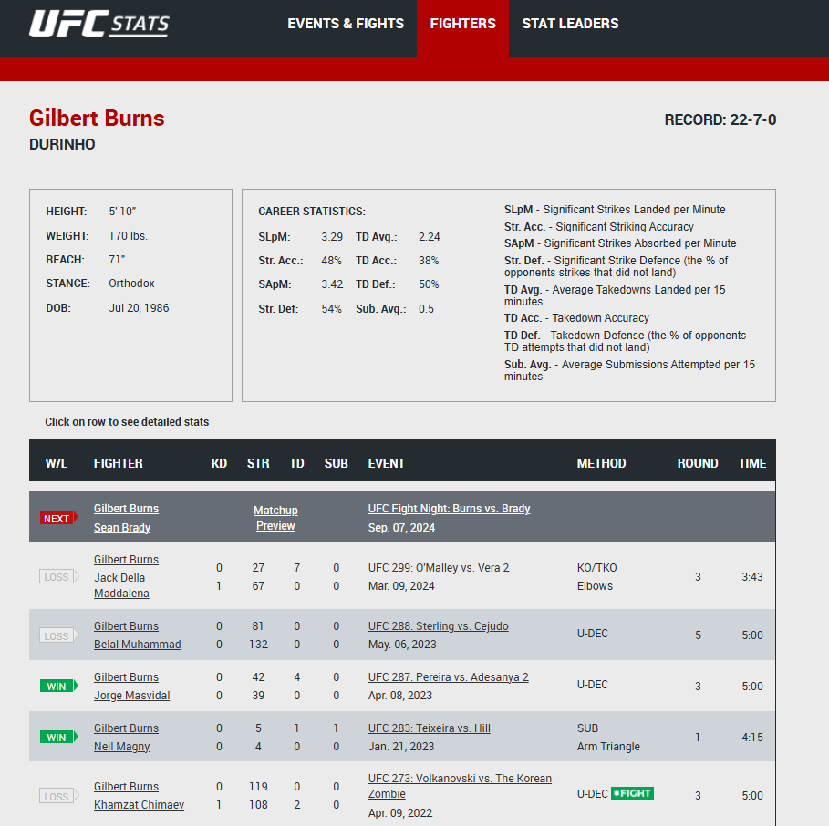

# FantasyMMACalculator

## FantasyMMACalculator streamlines UFC Fantasy MMA data collection, making it easier for users to access essential information.

This project aims to simplify collecting datasets for UFC Fantasy MMA. Currently, I want to do personal analysis, so I am starting at the beginning by making it easy to collect individual fighters fantasy scores based on their UFC stats profile. As I continue to work 


## How to install
1. Clone this project
2. Run the following commnad:
    ```bash
    pip install -r requirements.txt

## How to use
    
    python main.py url_link_here


## Example use case


1. find the link to a fighters main page with all their bouts.
2. paste link into python main.py http://ufcstats.com/fighter-details/23024fdfc966410a
3. current output
    ```
        Gilbert Burns: 55.81
        Jack Della Maddalena: 85.88

        Belal Muhammad: 122.80000000000001
        Gilbert Burns: 32.4

        Gilbert Burns: 83.03
        Jorge Masvidal: 23.35

        Gilbert Burns: 102.65
        Neil Magny: 1.6

        .
        .
        .